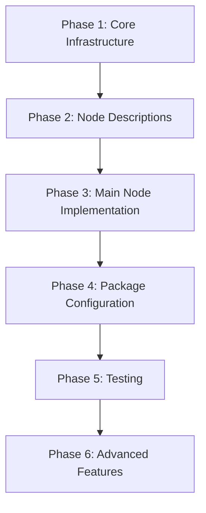

# Zoho Bigin API Integration - Implementation Plan

> Comprehensive implementation plan for adding Zoho Bigin CRM integration to n8n-nodes-zoho

## 📋 Overview

This documentation outlines the complete implementation plan for integrating Zoho Bigin API into the n8n-nodes-zoho package. Zoho Bigin is a lightweight, pipeline-centric CRM designed for small businesses, offering a simplified alternative to the full Zoho CRM.

## 🎯 Project Goals

1. **Add comprehensive Bigin API support** to the n8n-nodes-zoho package
2. **Maintain consistency** with existing node patterns and architecture
3. **Support all major Bigin modules**: Pipelines, Contacts, Accounts, Products, Tasks, Events, Notes
4. **Enable multi-regional support** for all Zoho data centers (US, EU, AU, IN, CN, JP, SA, CA)
5. **Provide robust error handling** and user-friendly parameter configuration

## 🏗️ Architecture Overview

### Key Characteristics of Bigin API

- **API Version**: REST API v2
- **Base URL Pattern**: `https://www.zohoapis.{region}/bigin/v2/`
- **Authentication**: OAuth2 with Zoho-specific scopes
- **Request Format**: JSON
- **Response Format**: JSON

### Supported Regions

| Region | Base URL |
|--------|----------|
| US (Default) | `https://www.zohoapis.com/bigin/v2/` |
| EU | `https://www.zohoapis.eu/bigin/v2/` |
| AU | `https://www.zohoapis.com.au/bigin/v2/` |
| IN | `https://www.zohoapis.in/bigin/v2/` |
| CN | `https://www.zohoapis.com.cn/bigin/v2/` |
| JP | `https://www.zohoapis.jp/bigin/v2/` |
| SA | `https://www.zohoapis.sa/bigin/v2/` |
| CA | `https://www.zohoapis.ca/bigin/v2/` |

### OAuth2 Scopes Required

```
ZohoBigin.modules.ALL
ZohoBigin.settings.ALL
ZohoBigin.users.ALL
ZohoBigin.org.read
ZohoBigin.coql.READ
```

## 📚 Documentation Structure

### Phase Documentation

Implementation is organized into 6 phases, each with detailed documentation:

1. **[Phase 1: Core Infrastructure Setup](./phases/phase-1-core-infrastructure.md)**
   - OAuth2 credential updates
   - Generic API functions
   - Base URL mapping

2. **[Phase 2: Node Descriptions](./phases/phase-2-node-descriptions.md)**
   - Parameter definitions for each resource
   - Operation configurations
   - Field specifications

3. **[Phase 3: Main Node Implementation](./phases/phase-3-main-node.md)**
   - ZohoBigin.node.ts structure
   - Execute method implementation
   - Resource/operation routing

4. **[Phase 4: Package Configuration](./phases/phase-4-package-config.md)**
   - package.json updates
   - Build configuration
   - Distribution setup

5. **[Phase 5: Testing & Documentation](./phases/phase-5-testing.md)**
   - Test coverage requirements
   - Documentation updates
   - Usage examples

6. **[Phase 6: Advanced Features](./phases/phase-6-advanced-features.md)**
   - COQL query support
   - Webhook capabilities
   - Bulk operations

### Module Documentation

Each Bigin module has dedicated documentation:

1. **[Pipelines Module](./modules/pipelines.md)** - Core deal/opportunity management
2. **[Contacts Module](./modules/contacts.md)** - Contact/people management
3. **[Accounts Module](./modules/accounts.md)** - Company/organization management
4. **[Products Module](./modules/products.md)** - Product catalog management
5. **[Tasks Module](./modules/tasks.md)** - Task management
6. **[Events Module](./modules/events.md)** - Calendar event management
7. **[Notes Module](./modules/notes.md)** - Note-taking and annotations

## 🔄 Implementation Workflow



### Recommended Implementation Order

1. **Start with Phase 1** - Core infrastructure must be in place first
2. **Prioritize core modules**:
   - Pipelines (highest priority - core to Bigin)
   - Contacts (high priority)
   - Accounts (high priority)
   - Products (medium priority)
   - Tasks, Events, Notes (lower priority)
3. **Test incrementally** - Test each module as it's implemented
4. **Document as you go** - Update user documentation alongside code

## 🎨 Design Principles

### Consistency with Existing Nodes

- Follow the pattern established in `ZohoBilling.node.ts`
- Use description files for parameter organization
- Implement structured inputs (not raw JSON) where practical
- Maintain consistent error handling patterns

### User Experience

- Clear, descriptive parameter names
- Helpful descriptions and tooltips
- Logical operation groupings
- Sensible default values
- Support for both simple and advanced use cases

### Code Quality

- TypeScript strict mode compliance
- No `any` types - use explicit types
- Comprehensive error handling
- Clear code comments
- TSLint compliance

## 📊 Effort Estimation

| Phase/Module | Estimated Hours | Priority |
|--------------|----------------|----------|
| Phase 1: Core Infrastructure | 2-3 | Critical |
| Pipelines Module | 4-5 | High |
| Contacts Module | 3-4 | High |
| Accounts Module | 3-4 | High |
| Products Module | 2-3 | Medium |
| Tasks Module | 2-3 | Medium |
| Events Module | 2-3 | Medium |
| Notes Module | 2-3 | Low |
| Testing & Documentation | 4-6 | High |
| Advanced Features | 4-6 | Low |
| **Total** | **29-39 hours** | |

## 🔍 Key Differences: Bigin vs Zoho CRM

Understanding these differences is crucial for proper implementation:

| Feature | Zoho CRM | Zoho Bigin |
|---------|----------|------------|
| **Target Audience** | Medium to large businesses | Small businesses |
| **Leads Module** | ✅ Yes | ❌ No (pipeline-centric) |
| **Primary Module** | Deals | Pipelines |
| **Companies** | Called "Accounts" | Called "Companies" (API: Accounts) |
| **Forecasting** | ✅ Yes | ❌ No |
| **Complexity** | High customization | Simplified, focused |
| **API Base Path** | `/crm/v2/` | `/bigin/v2/` |
| **Pricing Model** | Per user, tiered | Flat rate, small teams |

## 🚀 Getting Started

To begin implementation:

1. **Review all phase documentation** in the `phases/` directory
2. **Study module specifications** in the `modules/` directory
3. **Set up development environment** as per CLAUDE.md
4. **Start with Phase 1** - Core Infrastructure
5. **Implement modules incrementally**, testing as you go

## 📖 Additional Resources

### Official Zoho Bigin Documentation

- **API Overview**: https://www.bigin.com/developer/docs/apis/v2/
- **OAuth2 Guide**: https://www.bigin.com/developer/docs/apis/v2/oauth-overview.html
- **Scopes Reference**: https://www.bigin.com/developer/docs/apis/scopes.html
- **Modules API**: https://www.bigin.com/developer/docs/apis/v2/modules-api.html

### Internal Project Documentation

- **Main Project README**: ../../README.md
- **Developer Guide (CLAUDE.md)**: ../../CLAUDE.md
- **Existing Nodes**: ../../nodes/
- **Credential Configuration**: ../../credentials/ZohoApi.credentials.ts

## 📝 Notes for Implementers

### Before You Start

- ✅ Ensure you have n8n-workflow v1.82.0+ installed
- ✅ Review existing node implementations (especially ZohoBilling)
- ✅ Set up Zoho Developer account for testing
- ✅ Configure OAuth2 credentials with Bigin scopes
- ✅ Understand TypeScript strict mode requirements

### During Implementation

- ⚠️ Always test with actual Bigin API (not just type checking)
- ⚠️ Handle regional endpoints correctly
- ⚠️ Test with multiple item inputs (n8n processes arrays)
- ⚠️ Implement proper error handling for all API calls
- ⚠️ Use `continueOnFail` pattern for resilient workflows

### After Implementation

- 🎯 Run full test suite
- 🎯 Update package.json with new node
- 🎯 Build and test in actual n8n instance
- 🎯 Document usage examples
- 🎯 Update main README.md

## 🤝 Contributing

When contributing to this implementation:

1. **Follow the phase order** unless there's a good reason not to
2. **Update this documentation** as implementation progresses
3. **Add code examples** to module documentation when features are complete
4. **Test thoroughly** - Bigin is production software for real businesses
5. **Commit regularly** with clear, descriptive messages

## 📜 License

This implementation follows the GPL-3.0 license of the parent project.

---

**Last Updated**: 2025-11-14
**Implementation Status**: Planning Phase
**Target Completion**: TBD
**Lead Developer**: Claude Code Assistant
